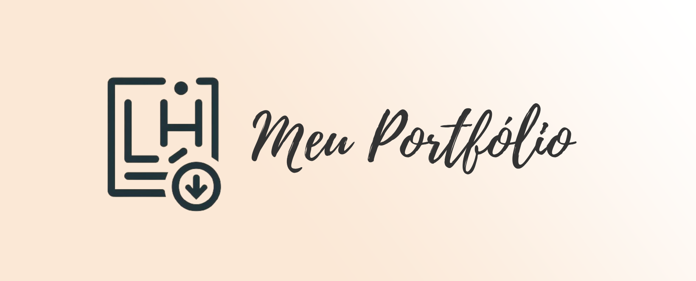

<h1 align="center"> ☁ Meu Portfólio - LH</h1>

<br />

<div align="center">
    
    
    
    
    
    
    
    
</div>

<br />

<div align="center">
    
</div>

<br />

<div style="margin-top: 3%;">
    <h2>🎯 Descrição do projeto</h2>
    <p align="justify">
        Bem-vindo ao meu portfólio! Aqui você irá encontrar um pouco sobre mim, minha trajetória e todos os meus projetos realizados até agora.
    </p>
    <p align='justify'>
        A partir deste readme, você pode escolher visualizar meu portfólio diretamente acessando este <a href='https://portfolio-lh.vercel.app/'>LINK</a> ou seguir lendo mais detalhadamente sobre o projeto.
    </p>
</div>

<br />

## 📌Sumário
* [Título e Imagem de capa](#Título-e-Imagem-de-capa)
* [Tecnologias utilizadas](#Tecnologias-utilizadas)
* [Descrição do projeto](#Descrição-do-projeto)
* [Sumário](#Sumário)
* [Apresentação do site](#Apresentação-do-site)
* [Instalação](#Instalação)
* [Executando o site](#Executando-o-site)
* [Status do projeto](#Status-do-projeto)
* [Contato](#Contato)

<br />

## 💻 Apresentação do site
<h4> 🖥 Versão desktop</h2>

<h4>📱Versão mobile</h4>


<br />

## 📥 Instalação
<h2>Baixando o repositório</h2>

<h3>🚨 Passo 1: configurar sua credencial</h3>

<p>1- Primeiramente é necessário criar seu Token. Para isso abra seu github, vá em "Settings" depois "Developer settings".</p>
<p>2- Clique em "Personal Access tokens" e depois "Tokens(classic)".</p>
<p>3- Vá em "Generete new token" e "Generete new token classic".</p>
<p>4- Coloque um nome em "Note" e um prazo de expiração (é recomendado 7 dias).</p>
<p>5- Selecione todas as caixinhas e depois clique em "Generete token". Em seguida você copia o seu Token e guarda-o em algum lugar (recomenda-se o email ou bloco de notas)</p>
<p>6- Em seguida, pesquise na barra de tarefas do windows "gerenciador de credenciais"</p>
<p>7- Clique em "credenciais do windows" e depois em "adicionar uma credencial genérica"</p>
<p>8- Em "endereço de rede ou internet" coloque:</p>
      
      git:https://github.com
      
<p>9- Em "nome de usuário" coloque o seu nome de usuário do github</p>
<p>10- Em senha coloque seu Token que você gerou e copiou</p>
<br>

<h3>🗂 Passo 2: Clonar o repositório</h3>
<br>

*Caso você já tenha o git instalado no seu computador siga o passo a passo abaixo

<p>1- Crie na área de trabalho uma pasta</p>
<p>2- Digite "cmd" na barra de endereço da pasta</p>

<p>3- Para iniciar:</p>

    git init
    
<p>4- Para colocar sua branch na main:</p>

    git checkout -b main
    
<p>5- Para configurar o usuário:</p>

    git config --local user.name "SEU NOME"
    
<p>6- Para configurar seu E-mail:</p>

    git config --local user.email "seu@email.com"

<p>7- Digite os seguinte comandos no terminal para clonar:</p>

    git clone https://github.com/LeticiaHelena/Portfolio_DD.git

<br>

*Caso você não tenha o git em seu computador execute este passo a passo antes do anterior 

<p>1- Clique no link abaixo para instalar o git: </p>

    https://git-scm.com/downloads

<p>2- Selecione o sistema do seu computador (Linux, Windows ou Mac) para fazer o download</p>
<p>3- Selecione a opção que condiz com a quantidade de bits do seu computador</p>
<p>4- Após a instalação basta seguir o passo a passo acima 🔝</p>

<br />
    
## 🛠 Executando o site

1. Abra o VSCode (caso não o tenha instalado, clique [aqui](https://code.visualstudio.com/download)) e pressione Ctrl+J para abrir o terminal.
2. No terminal, execute o seguinte comando:

   ```bash
   npm install
3. Isso irá baixar todos os pacotes necessários (mas ATENÇÃO! é necessário ter instalado o NodeJs para executar o comando acima)
4. Logo após dê o comando:
   ```bash
   npm start
5. Isso iniciará o site e fará com que ele seja aberto em uma guia do seu navegador padrão

<br />

## 📊 Status do projeto

<p>O projeto irá permanecer em desenvolvimento sempre, pois irei adicionar todos os projetos já realizados por mim nele e alimentá-lo com demais informações.</p>

<br />

## ☎ Contato

<div>
  <a href="www.linkedin.com/in/letícia-helena-carvalho" target="_blank" title="LinkedIn">
    
  </a>
  
  <a href="https://github.com/leticiacarvalho04" target="_blank" title="GitHub">
    
  </a>

  <a href="[https://twitter.com/seu-usuario](https://www.instagram.com/carvalho_leticia04/)" target="_blank" title="Twitter">
    
  </a>
</div>
